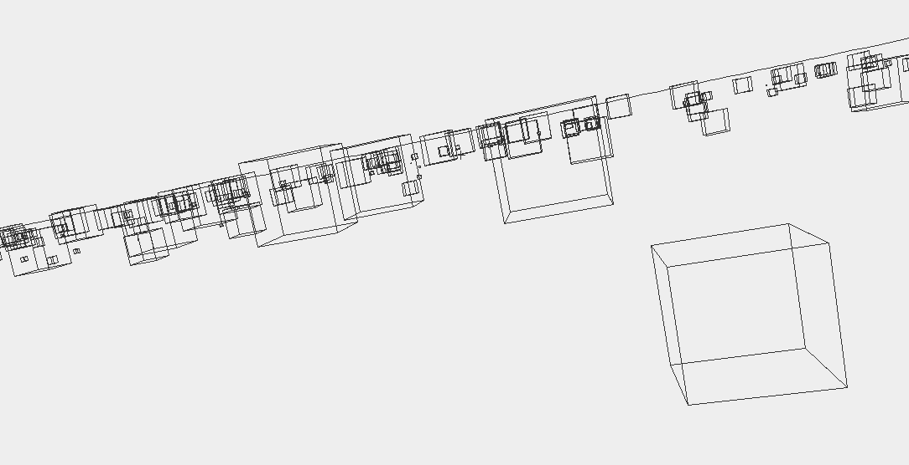

## <p align="center">Andrew Formosa</p>

After many years working in business management, I'm finally planning on changing direction and starting down a new career path which incorporates my love of coding and application development which began with my first ZX Spectrum programs written at the age of 10 years old.
My aim is to collate some of my recent projects, experiments and ideas and to showcase them on this page...at some point..

##Some of my Projects


|||||
| ------------- | ------------- | ------------- | ------------- |
| [Zoom Project](https://andrewformosa.github.io/ZoomExample) | |   |  |
## Welcome to GitHub Pages

You can use the [editor on GitHub](https://github.com/AndrewFormosa/AndrewFormosa.github.io/edit/main/README.md) to maintain and preview the content for your website in Markdown files.

Whenever you commit to this repository, GitHub Pages will run [Jekyll](https://jekyllrb.com/) to rebuild the pages in your site, from the content in your Markdown files.


https://user-images.githubusercontent.com/65806732/178146755-b8a3893e-7eae-41a1-8f9e-0a51d59bbfff.mp4


### Markdown

Markdown is a lightweight and easy-to-use syntax for styling your writing. It includes conventions for

```markdown
Syntax highlighted code block

# Header 1
## Header 2
### Header 3

- Bulleted
- List

1. Numbered
2. List

**Bold** and _Italic_ and `Code` text

[Link](url) and 
```

For more details see [Basic writing and formatting syntax](https://docs.github.com/en/github/writing-on-github/getting-started-with-writing-and-formatting-on-github/basic-writing-and-formatting-syntax).

### Jekyll Themes

Your Pages site will use the layout and styles from the Jekyll theme you have selected in your [repository settings](https://github.com/AndrewFormosa/AndrewFormosa.github.io/settings/pages). The name of this theme is saved in the Jekyll `_config.yml` configuration file.

### Support or Contact

Having trouble with Pages? Check out our [documentation](https://docs.github.com/categories/github-pages-basics/) or [contact support](https://support.github.com/contact) and we’ll help you sort it out.
